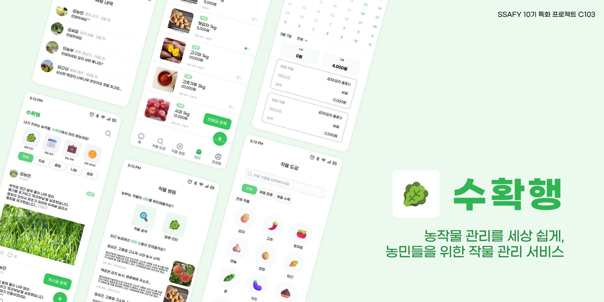
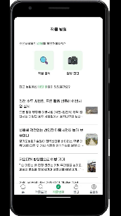
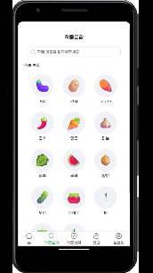
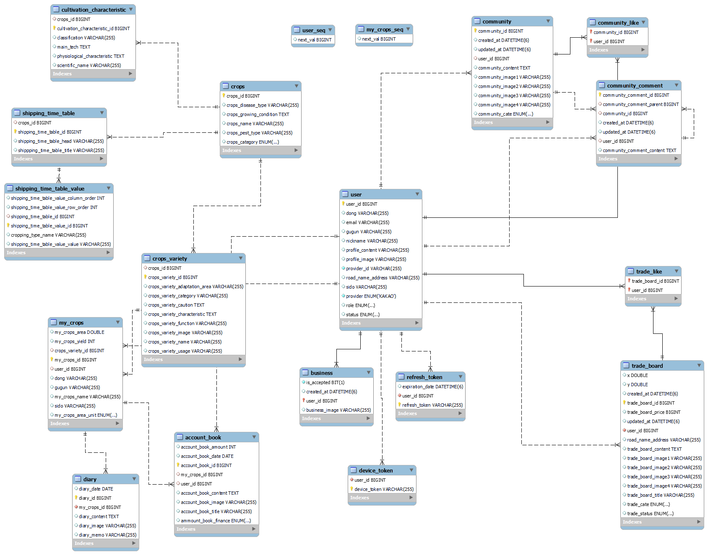

# 🌿🌾 수확행 (농작물 관리를 세상 쉽게, 농민들을 위한 작물 관리 서비스)

-   SSAFY 10기 2학기 특화 프로젝트 (도메인: 인공지능 영상)

-   프로젝트 기간: 2024/02/26 ~ 2024/04/04

-   서비스 바로 가기: [apk 다운로드 링크](https://drive.google.com/file/d/1AOGnOemdUMYsREo-WDJIZIRlhx45Le7V/view?usp=drive_link)

-   UCC 보러 가기: [수확행 UCC](https://www.youtube.com/)

## 🍀 프로젝트 소개

> 농작물 관리를 세상 쉽게, 농민들을 위한 작물 관리 서비스

1️⃣ 작물 병해 진단

2️⃣ 작물 거래(실시간 채팅)

3️⃣ 작물 도감

4️⃣ 커뮤니티

5️⃣ 정부 보조금, 지원 사업 조회

## 🍀 기능 소개

### - 작물 병해 진단 🚑

-   ResNET101을 통해 학습된 인공지능 모델으로부터 작물의 질병 여부 판단
-   질병이 있을 경우 질병의 발생 환경, 주요 증상, 예방 및 방제 대책 제공

### - 작물 거래 💸

-   작물부터 농자재, 일손, 체험까지 거래할 수 있는 플랫폼 제공
-   사업자만이 등록할 수 있어, 신뢰도 높은 거래 가능
-   실시간 채팅을 통해 판매자와의 1:1 커뮤니케이션 기능 제공
-   장터 글 목록 무한 스크롤 구현

### - 작물 도감 🥕

-   크롤링을 통해 수집한 다양한 작물 품종에 대한 정보(용도, 추천 재배 기간, 병해 종류 등) 제공

### - 커뮤니티 💬

-   농민 간의 정보 공유 경험 제공을 위해 커뮤니티 플랫폼 제공
-   자유, 나눔, 팁, 질문과 같이 원하는 게시글 모아보기 기능 제공
-   커뮤니티 글 목록 무한 스크롤 구현

### - 정부 보조금, 지원 사업 조회 💰

-   크롤링을 통해 수집한 농업 관련 정부 보조금 리스트 제공
-   목록 조회 무한 스크롤 구현

### - FCM을 통한 알림 기능 🔔

-   내가 작성한 게시글에 댓글/대댓글이 달리거나, 상대방으로부터 채팅이 오면 푸시알림 OR 토스트메세지 알림

## 🍀 주요 서비스 화면

|               소셜로그인 (카카오)               |                    작물병해진단                    |
| :---------------------------------------------: | :------------------------------------------------: |
|   |             |
|                    작물 도감                    |                 작물 거래(게시판)                  |
|       |          |
|              작물 거래(채팅, FCM)               |                      커뮤니티                      |
|               |          |
|                정부 보조금 조회                 |                   영농일지/장부                    |
|  |  |
|                   병충해 뉴스                   |                    사업자 등록                     |
|               |          |
|                  내 지역 날씨                   |                                                    |
|              |                                                    |

## 📚 기술 스택

### FrontEnd

-   React Native `0.73.4`
-   Typescript `5.1.3`
-   Recoil `0.7.7`
-   FCM / Filrebase Storage `19.0.1`
-   Encryted-Storage `4.0.3`
-   Socket
-   StompJS `7.0.0`
-   Styled-Components `6.1.8`
-   Axios `1.6.7`
-   Node.js `v20.11.0`

### BackEnd

-   JDK `17`
-   Spring Boot `3.2.3`
-   Spring Cloud `4.1.1`
-   JPA
-   QueryDSL `5.0.0`
-   MySQL `8.0.33`
-   MongoDB
-   RabbitMQ
-   FCM
-   STOMP
-   Scheduler
-   Selenium `4.18.0`

### AI

-   Python `3.11`
-   Tensorflow `2.16.1`
-   Keras `3.1.1`
-   Sklearn
-   Numpy `1.26.4`
-   FastAPI `0.110.0`
-   CNN(ResNet101)

### Infra

-   AWS EC2
-   AWS RDS
-   Docker
-   Jenkins

### 협업 툴

-   GitLab
-   Jira
-   Notion

## 📚 산출물

### 서비스 아키텍처

### ERD

### 와이어프레임

[Figma 바로가기](https://www.figma.com/file/KLa5YoXgr9IYqga20CFN6w/%EC%88%98%ED%99%95%ED%96%89?type=design&node-id=0%3A1&mode=design&t=SWZ4E8GaFjO4Bqws-1)

### API 명세

[API 명세 바로가기](./outputs/API_명세서.pdf)

## 📚 포팅 매뉴얼

[포팅 매뉴얼 바로 가기](./exec/포팅매뉴얼.md)

## 👨‍👨‍👧‍👦 팀원 및 역할

<table>
   <tr>
      <td align="center"><a href="https://github.com/Ahrang777"> <b>박정인 팀장, BackEnd</b></a></td>
      <td align="center"><a href="https://github.com/uhyeon19"> <b>김수린 BackEnd, FrontEnd, AI</b></a></td>
      <td align="center"><a href="https://github.com/jiwonss"> <b>서지원 BackEnd, Infra</b></a></td>
      <td align="center"><a href="https://github.com/eundeok9"> <b>조은서 FrontEnd</b></a></td>
      <td align="center"><a href="https://github.com/"> <b>오민상 FrontEnd</b></a></td>
      <td align="center"><a href="https://github.com/markrla"> <b>김범수 FrontEnd</b></a></td>
   </tr>
</table>

## 👨‍👨‍👧‍👦 팀 노션

추가 예정
